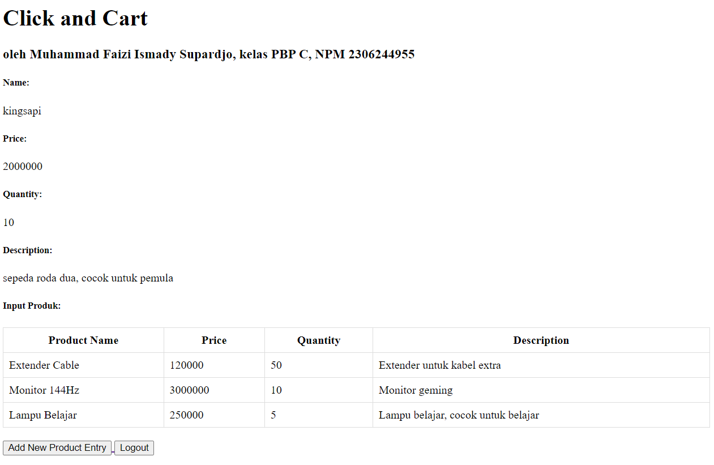

# click-and-cart: All your needs in one click

# Contents
- [Data Diri](#data-diri)<br>
- [Link Produk](#link-produk)<br>
- [Tugas 2](#tugas-2)<br>
- [Tugas 3](#tugas-3)<br>
- [Tugas 4](#tugas-4)<br>

## Data Diri
**Nama : Muhammad Faizi Ismady Supardjo**<br>
**NPM : 2306244955**<br>
**Kelas : PBP C**<br>

## Link Produk
**Tautan menuju PWS yang sudah di deploy :** "http://muhammad-faizi-clickandcart.pbp.cs.ui.ac.id"

# Tugas 2
- [Contents](#contents)<br>

**1. Jelaskan bagaimana cara kamu mengimplementasikan checklist di atas secara step-by-step (bukan hanya sekadar mengikuti tutorial).**

1.1. Membuat direktori dan mengaktifkan virtual environment<br>
- Buat direktori (folder) baru bernama sama dengan nama produk (dalam kasus ini `click-and-cart`)

- Gunakan IDE seperti vscode atau terminal. Buka direktori yang sudah dibuat dan jalankan perintah `python -m venv env` untuk membuat virtual environment

- Jalankan virtual environment dengan perintah `env\Scripts\activate`. Jika venv berhasil aktif, akan ada (env) di depan baris terminal

1.2. Membuat projek Django (checklist 1)<br>
- Di dalam direktori `click-and-cart` buat file `requirements.txt` dan isi dengan
```bash
    django
    gunicorn
    whitenoise
    psycopg2-binary
    requests
    urllib3
```

- Install dependencies dengan perintah `pip install -r requirements.txt`

- Buat projek django bernama click_and_cart dengan perintah `django-admin startproject click_and_cart .` yang berfungsi membuat folder bernama proyek tersebut dengan isi file bawaan dari django

- Tambahkan string pada ALLOWED_HOSTS di `settings.py` direktori `click_and_cart`
```bash
    ALLOWED_HOSTS = ["localhost", "127.0.0.1"]
```

-  Membuat berkas `.gitignore` untuk menentukan file yang tidak ingin dimasukkan ke dalam versi kontrol Git

1.3. Membuat aplikasi bernama main pada proyek (checklist 2)<br>
- Buat aplikasi bernama `main` dengan perintah berikut `python manage.py startapp main` di dalam direktori
- Tambahkan `main` kedalam INSTALLED_APPS pada file `settings.py`. Main merefer ke file html yakni `main.html`

1.4. Melakukan routing pada proyek agar dapat menjalankan aplikasi main (checklist 3)<br>
- Melakukan routing dengan menambahkan kode ini dalam `urls.py`
```bash
    from django.contrib import admin
    from django.urls import path
    from django.urls import path, include

    urlpatterns = [
        path('', include('main.urls')),
        path('admin/', admin.site.urls), path('', include('main.urls'))
    ]
```

1.5. Membuat model pada aplikasi main dengan nama Product dan memiliki atribut wajib name, price, dan description (checklist4)<br>
- Isi `models.py` dengan kode berikut
```bash
    from django.db import models

    class Product(models.Model):
        name = models.CharField(max_length=255)
        price = models.IntegerField()
        description = models.TextField()
        quantity = models.IntegerField()
```

Note: atribut quantity opsional

1.6. Membuat sebuah fungsi pada `views.py` untuk dikembalikan ke dalam sebuah template HTML yang menampilkan nama aplikasi serta nama dan kelas. (checklist 5)<br>
- Isi file `views.py` dengan kode berikut untuk dapat dikembalikan ke `main.html`
```bash
    from django.shortcuts import render

    # Create your views here
    def show_main(request):
        context = {
            'name': 'Sepeda',
            'price' : '2000000',
            'quantity' : '10',
            'description': 'sepeda roda dua, cocok untuk pemula'
        }

        return render(request, "main.html", context)
```

- Isi file `main.html` dengan kode berikut
```bash
    <h1>Click and Cart</h1>
    <h3>oleh Muhammad Faizi Ismady Supardjo, kelas PBP C, NPM 2306244955</h3>

    <h5>Name: </h5>
    <p>{{ name }}<p>
    <h5>Price: </h5>
    <p>{{ price }}<p>
    <h5>Quantity: </h5>
    <p>{{ quantity }}<p>
    <h5>Description: </h5>
    <p>{{ description }}<p>
```

1.7. Membuat sebuah routing pada `urls.py` aplikasi main untuk memetakan fungsi yang telah dibuat pada `views.py`. (checklist 6) <br>
- Isi file `urls.py` pada direktori main dengan kode berikut agar dapat menghubungkan `views.py` di dalam direktori main dengan `urls.py`
```bash
    from django.urls import path
    from main.views import show_main

    app_name = 'main'

    urlpatterns = [
        path('', show_main, name='show_main'),
    ]
```

1.8. Melakukan deployment ke PWS terhadap aplikasi yang sudah dibuat sehingga nantinya dapat diakses oleh orang lain melalui Internet. <br>
- Buka laman PWS, jika belum memiliki akun register jika sudah login

- Buat proyek baru pada website PWS dengan menekan tombol Create New Project. Lalu, isi Project Name dengan clickandcart. setelah itu, tekan Create New Project.

- Akan muncul string credentials yang perlu kita simpan sendiri karena tidak dapat dilihat lagi.

- Pada `settings.py` di proyek Django, tambahkan URL deployment PWS pada ALLOWED_HOSTS. Isi ALLOWED_HOSTS menjadi
```bash
    ALLOWED_HOSTS = ["localhost", "127.0.0.1", "muhammad-faizi-clickandcart.pbp.cs.ui.ac.id"]
```

- Buat repositori github bernama `click-and-cart`. Lalu add commit dan push perubahan kedalam repositori tersebut. Jalankan perintah project command yang terlihat di website PWS. Terakhir lakukan command berikut `git push pws main` yang berfungsi push dari github ke pws. Jika PWS tidak error, seharusnya projek sudah berhasil di launch.

1.9. Membuat sebuah `README.md` yang berisi tautan menuju aplikasi PWS yang sudah di-deploy, serta jawaban dari beberapa pertanyaan berikut. (checklist 7)<br>
- Buat file `README.md` pada direktori `click-and-cart` terluar dan isi sesuai dengan Tugas 2 PBP.

**2. Buatlah bagan yang berisi request client ke web aplikasi berbasis Django beserta responnya dan jelaskan pada bagan tersebut kaitan antara urls.py, views.py, models.py, dan berkas html.**


Pada Django, apabila klien/user mengirim HTTP request melalui web platform, request tersebut (address HTTP yang dikirim klien)akan di cek sesuai atau tidak pada file `urls.py`. Jika request sesuai, akan dilanjutkan ke file `views.py` yang kemudian memperoleh data dari `models.py` berisi atribut-atribut. Setelah itu, data dan atribut akan di proses di template yang berisi main.html. Lalu, setelah data sudah ada di dalam template, template akan menghasilkan respon ke web platform, menampilkan tampilan web pada `views.py`

**3. Jelaskan fungsi git dalam pengembangan perangkat lunak!**<br>

3.1. Melacak perubahan kode
    Git dapat melacak perubahan kode yang dilakukan selama proses development. Setiap kali ingin melakukan perubahan dan disimpan di Git (add commit push), Git memiliki log versi sebelum update dan sesudah update sehingga memudahkan melihat perubahan kode.

3.2. Memudahkan kolaborasi
    Git membuat developer dapat bekerja pada proyek yang sama tanpa mengganggu bagian (fitur) satu sama lain. Untuk menggabung perubahan git mengatur proses "merging".

3.3. Branching
    Git membuat developer dapat membuat branch (cabang), yang merupakan copy dari kode utama. Hal ini memungkinkan developer untuk mengetes fitur seperti update, debug, dll yabg kemudian dapat digabungkan kembali ke cabang utama.

3.4. Backup File
    Karena Git melacak perubahan kode (file) maka dapat menjadi tempat backup file apabila terjadi error.

**4. Menurut Anda, dari semua framework yang ada, mengapa framework Django dijadikan permulaan pembelajaran pengembangan perangkat lunak?**
<br>Alasan Django menjadi permulaan pembelajaran PBP adalah Django cocok untuk pemula, beberapa alasan diantaranya yakni:

<br>4.1. Menyediakan Struktur yang Terorganisir
    MTV (Model-Template-View) memberikan struktur yang jelas dan terorganisir untuk pengembangan aplikasi web. Pemula dapat memahami bagaimana bagian-bagian aplikasi bekerja sama, seperti:
    - Model untuk interaksi dengan database (ORM),
    - View untuk mengelola logika aplikasi,
    - Template untuk menyusun tampilan front-end.

4.2. Memiliki banyak built in features

4.3. Menggunakan Python
    Selain python yang bahasanya relatif mudah dipelajari, kita sudah belajar python pada semester 1 sehingga memudahkan pembelajaran PBP.

4.4. Skalabel dan Fleksibel
    Django dapat digunakan baik untuk proyek kecil maupun besar.

4.5. Keamanan
    Django relatif aman terhadap ancaman siber umum.

**5. Mengapa model pada Django disebut sebagai ORM?**
<br>Alasan model pada Django disebut ORM (Object-Relational Mapping) adalah karena Django memungkinkan developer untuk berhubungan dengan data base pada kode python. Django berfungsi sebagai penghubung antara objek-objek dalam kode dan data dalam data base. Dengan ORM kita dapat membuat data base menggunakan Python (dictionary dalam kasus proyek ini) dan otomatis menghasilkan pernyataan SQL untuk dapat berhubungan dengan data base model.

# Tugas 3
- [Contents](#contents)<br>
- [Screenshot Postman](#screenshot-postman)<br>

**1. Jelaskan mengapa kita memerlukan data delivery dalam pengimplementasian sebuah platform?**<br>
Data delivery adalah proses terjadinya proses pengiriman atau distribusi data dari suatu sistem, server, atau aplikasi ke sistem lain (antarsistem) atau ke pengguna. Data delivery mencakup transfer data antar server, komunikasi antar aplikasi, sinkronisasi informasi, serta pengiriman data real-time ke perangkat atau sistem yang memerlukan akses informasi secara tepat waktu. Tentu kita memerlukan data delivery dalam pengimplementasian sebuah platform karena data delivery memastikan platform dapat beroperasi dengan efisien dan responsif. Contohnya ada user yang mengirim data melalui form, tentu server harus dengan cepat memberi umpan balik ke pengguna apakah data tersebut berhasil masuk.

**2. Menurutmu, mana yang lebih baik antara XML dan JSON? Mengapa JSON lebih populer dibandingkan XML?**<br>
Menurut saya, JSON (JavaScript Object Notation) lebih baik dibanding XML (eXtensible Markup Language). Beberapa alasan JSON lebih populer dibanding XML:<br>

- Lebih sederhana: JSON memiliki sintaks yang dapat dibilang cukup sederhana (mirip dictionary pada Python) dibanding XML yang memerlukan tag pembuka dan penutup.

- Struktur data: JSON memiliki struktur data yang fleksibel dan ukuran data yang lebih kecil dikarenakan format yang ringkas.

- Terintegrasi: Penggunaan JSON sangat umum dalam pemrograman web.

**3. Jelaskan fungsi dari method is_valid() pada form Django dan mengapa kita membutuhkan method tersebut?**<br>
Fungsi method is_valid() pada form Django adalah untuk memeriksa apakah data yang dimasukkan oleh pengguna valid atau tidak berdasarkan aturan validasi yang telah ditentukan di form. Metode ini mengecek apakah semua field yang diperlukan diisi, apakah format data sesuai (field, parameter, dll), dan apakah ada kesalahan dalam input.

Setelah memanggil is_valid(), Django akan:<br>
- Melakukan Validasi: Memastikan bahwa data yang dimasukkan sesuai dengan persyaratan (misalnya, panjang string, tipe data, atau aturan khusus lain yang diterapkan pada form).

- Mengisi Atribut cleaned_data: Jika data valid, is_valid() akan mengembalikan True, dan data yang telah dibersihkan akan tersedia di atribut cleaned_data. Ini memudahkan developer untuk mengakses data yang telah diproses dan valid.

- Menyimpan Error Jika Tidak Valid: Jika data tidak valid, is_valid() akan mengembalikan False, dan pesan error akan disimpan di atribut errors, yang dapat ditampilkan kembali kepada pengguna untuk perbaikan.

Alasan method is_valid() dibutuhkan:<br>
- Mencegah Input Tidak Valid: Tanpa proses validasi, pengguna dapat mengirimkan data dalam berbagai bentuk yang tidak sesuai atau tidak aman (misalnya, SQL injection, XSS). Dengan validasi, hanya data yang memenuhi aturan yang bisa diproses lebih lanjut.

- Keamanan Data: Validasi membantu mencegah potensi serangan dan menjaga integritas serta keamanan aplikasi, memastikan bahwa data yang diterima sesuai dan tidak berbahaya.

- Pengalaman Pengguna: is_valid() membantu mengidentifikasi kesalahan input pengguna, memberikan umpan balik yang bermanfaat, dan memastikan data yang dikirim benar sebelum diproses lebih lanjut.<br>

Kesimpulannya, is_valid() memastikan hanya data yang benar dan sesuai yang masuk ke dalam sistem.

referensi: https://www.javatpoint.com/django-form-validation

**4. Mengapa kita membutuhkan csrf_token saat membuat form di Django? Apa yang dapat terjadi jika kita tidak menambahkan csrf_token pada form Django? Bagaimana hal tersebut dapat dimanfaatkan oleh penyerang?** <br>
csrf_token (Cross Site Request Forgery Token) dibutuhkan saat membuat form di Django untuk melindungi aplikasi dari Cross Site Request Forgery. Cross Site Request Forgery adalah bentuk penyerangan dimana penyerang mencoba memaksa pengguna untuk menjalankan aksi tidak sah tanpa sepengetahuan mereka, contohnya transaksi.

Apabila tidak menambahkan csrf_token pada form Django maka aplikasi menjadi rentan terhadap serangan csrf. Hal ini dimanfaatkan penyerang yang dapat dengan mudah memodifikasi situs sehingga pengguna tanpa sadar membuka situs tersebut. Adanya csrf_token pada form memastikan ada token unik pada setiap form yang dikirim ke server. Jika csrf_token tidak ada, aplikasi tidak bisa menentukan mana form yang sah atau tidak.

**5. Jelaskan bagaimana cara kamu mengimplementasikan checklist di atas secara step-by-step (bukan hanya sekadar mengikuti tutorial).**<br>
5.1. Membuat direktori baru `templates` pada root folder dan isi dengan file `base.html`. File `base.html` berisi:
```bash

<!DOCTYPE html>
<html lang="en">
  <head>
    <meta charset="UTF-8" />
    <meta name="viewport" content="width=device-width, initial-scale=1.0" />
     
  </head>

  <body>
     
  </body>
</html>
```
5.2. Menambahkan line berikut pada `settings.py`
```bash
'DIRS': [BASE_DIR / 'templates'],
```

5.3. Mengubah `main.html` yang ada pada main/templates/ untuk mengextend `base.html`. Dilakukan dengan menambah line berikut dipaling atas.
```bash

```

5.4. Memodifikasi `models.py` untuk menjaga keamanan website dengan menambahkan atribut id.
```bash
import uuid
from django.db import models

class Product(models.Model):
    id = models.UUIDField(primary_key=True, default=uuid.uuid4, editable=False)
    name = models.CharField(max_length=255)
    price = models.IntegerField()
    description = models.TextField()
    quantity = models.IntegerField()
```

5.4.1 Lakukan migrasi model

5.5. Membuat form input data (checklist 1) dengan membuat file `forms.py` pada direktori main. Isi file sebagai berikut:
```bash
from django.forms import ModelForm
from main.models import Product

class ProductEntryForm(ModelForm):
    class Meta:
        model = Product
        fields = ["name", "price", "quantity", "description"]
```

5.6. Memodifikasi `views.py` dengan membuat method agar dapat menambah produk dari form yang disubmit dan memodifikasi show_main agar menerima parameter input dari form. Isi file sebagai berikut:
```bash
from django.shortcuts import render, redirect  
from main.forms import ProductEntryForm
from main.models import Product
from django.shortcuts import render

# Create your views here.
def show_main(request):
    product_entries = Product.objects.all()

    context = {
        'name': 'Sepeda',
        'price' : '2000000',
        'quantity' : '10',
        'description': 'sepeda roda dua, cocok untuk pemula',
        'product_entries' : product_entries
    }

    return render(request, "main.html", context)

def create_product_entry(request):
    form = ProductEntryForm(request.POST or None)

    if form.is_valid() and request.method == "POST":
        form.save()
        return redirect('main:show_main')

    context = {'form': form}
    return render(request, "create_product_entry.html", context)
```

5.6.1. Buka file `urls.py`, import method yang sudah dibuat, dan tambahkan path URL dengan menambahkan line berikut:
```bash
from main.views import show_main, create_product_entry

urlpatterns = [
    ...
    path('create-product-entry', create_product_entry, name='create_product_entry'),
]
```

5.7. Pada direktori main/templates/ buat file baru bernama `create_product_entry.html` dan isi sebagai berikut:
```bash
 

<h1>Add New Product Entry</h1>

<form method="POST">
  
  <table>
    {{ form.as_table }}
    <tr>
      <td></td>
      <td>
        <input type="submit" value="Add Product Entry" />
      </td>
    </tr>
  </table>
</form>

```

5.8. Modifikasi `main.html` pada main/templates/ agar dapat melihatkan data produk. Isi file sebagai berikut:
```bash


<h1>Click and Cart</h1>
<h3>oleh Muhammad Faizi Ismady Supardjo, kelas PBP C, NPM 2306244955</h3>

<h5>Name: </h5>
<p>{{ name }}<p>
<h5>Price: </h5>
<p>{{ price }}<p>
<h5>Quantity: </h5>
<p>{{ quantity }}<p>
<h5>Description: </h5>
<p>{{ description }}<p>


<p>Belum ada data product pada Click and Cart.</p>

<table>
  <tr>
    <th>Product Name</th>
    <th>Price</th>
    <th>Quantity</th>
    <th>Description</th>
  </tr>

  
  <tr>
    <td>{{product_entry.name}}</td>
    <td>{{product_entry.price}}</td>
    <td>{{product_entry.quantity}}</td>
    <td>{{product_entry.description}}</td>
  </tr>
  
</table>


<br />

<a href="">
  <button>Add New Product Entry</button>
</a>

```

5.8.1. Memodifikasi `views.py` agar dapat return data dalam bentuk XML dan JSON secara keseluruhan serta return data XML dan JSON sesuai id. Isi file dimodifikasi sebagai berikut:
```bash
from django.http import HttpResponse
from django.core import serializers
from django.shortcuts import render, redirect  
from main.forms import ProductEntryForm
from main.models import Product
from django.shortcuts import render

# Create your views here.
def show_main(request):
    product_entries = Product.objects.all()

    context = {
        'name': 'Sepeda',
        'price' : '2000000',
        'quantity' : '10',
        'description': 'sepeda roda dua, cocok untuk pemula',
        'product_entries' : product_entries
    }

    return render(request, "main.html", context)

def create_product_entry(request):
    form = ProductEntryForm(request.POST or None)

    if form.is_valid() and request.method == "POST":
        form.save()
        return redirect('main:show_main')

    context = {'form': form}
    return render(request, "create_product_entry.html", context)

def show_xml(request):
    data = Product.objects.all()
    return HttpResponse(serializers.serialize("xml", data), content_type="application/xml")

def show_json(request):
    data = Product.objects.all()
    return HttpResponse(serializers.serialize("json", data), content_type="application/json")

def show_xml_by_id(request, id):
    data = Product.objects.filter(pk=id)
    return HttpResponse(serializers.serialize("xml", data), content_type="application/xml")

def show_json_by_id(request, id):
    data = Product.objects.filter(pk=id)
    return HttpResponse(serializers.serialize("json", data), content_type="application/json")
```

5.8.2. Memodifikasi `urls.py` untuk mengimport method yang sudah dibuat dan menambahkan url patterns yang sesuai. Isi file sebagai berikut:
```bash
from django.urls import path
from main.views import show_main, create_product_entry, show_xml, show_json, show_xml_by_id, show_json_by_id

app_name = 'main'

urlpatterns = [
    path('', show_main, name='show_main'),
    path('create-product-entry', create_product_entry, name='create_product_entry'),
    path('xml/', show_xml, name='show_xml'),
    path('json/', show_json, name='show_json'),
    path('xml/<str:id>/', show_xml_by_id, name='show_xml_by_id'),
    path('json/<str:id>/', show_json_by_id, name='show_json_by_id'),
]
```

## Screenshot Postman
- [Contents](#contents)<br>

**JSON**


**XML**


**JSON by ID**


**XML by ID**


# Tugas 4
- [Contents](#contents)<br>
- [Foto akun pengguna](#foto-akun-pengguna)

**1. Apa perbedaan antara HttpResponseRedirect() dan redirect()**<br>
i. `HttpResponseRedirect()`
- Definisi: adalah kelas bawaan Django yang digunakan untuk membuat respons HTTP dengan kode status `302` (Redirect Found) untuk mengarahkan pengguna ke URL yang ditentukan.
- Sintaks:
```bash
from django.http import HttpResponseRedirect

def my_view(request):
    return HttpResponseRedirect('/some-url/')
```
- Parameter: url tujuan
- Kekurangan: Tidak bisa melakukan reverse lookup secara otomatis. Karena itu dalam tugas ini kita harus menggunakan fungsi reverse untuk mendapat url dari urls.py.

ii. `redirect()`<br>
- Definisi: adalah fungsi bantu (helper function) di Django yang lebih fleksibel dan mudah digunakan daripada HttpResponseRedirect(). Fungsi ini dapat otomatis mmengarahkan pengguna ke URL, view, nama URL, dll sehingga lebih praktis.
- Sintaks:
```bash
from django.shortcuts import redirect

def my_view(request):
    return redirect('/some-url/')
```
- Parameter: String URL, Nama view dari `urls.py`, dll.
- Keuntungan: Lebih fleksibel

**2. Jelaskan cara kerja penghubungan model MoodEntry dengan User!**<br>
Untuk menghubungkan model `MoodEntry` dengan model User dalam Django, Anda dapat menggunakan field `ForeignKey` pada model `MoodEntry` yang mengacu pada model User

- Contoh implementasi
```bash
from django.db import models
from django.contrib.auth.models import User

class MoodEntry(models.Model):
    user = models.ForeignKey(User, on_delete=models.CASCADE)
    mood = models.CharField(max_length=50)
    time = models.DateTimeField(auto_now_add=True)
    feelings = models.TextField()
    mood_intensity = models.IntegerField()

    def __str__(self):
        return f"{self.user.username} - {self.mood} at {self.time}"
```
- Penjelasan:<br>
Setiap ada user membuat input suasana hati, maka input tersebut dikaitkan dengan user yang login.<br>
Field user: Menggunakan ForeignKey untuk membuat hubungan many-to-one dengan model User. Parameter on_delete=models.CASCADE memastikan bahwa jika seorang pengguna dihapus, semua entri suasana hati yang terkait juga akan dihapus.

referensi = Django documentation

**3. Apa perbedaan antara authentication dan authorization, apakah yang dilakukan saat pengguna login? Jelaskan bagaimana Django mengimplementasikan kedua konsep tersebut.**<br>
i. Perbedaan:
- Authentication:<br>
Proses verifikasi identitas pengguna. Biasa melibatkan password dan username dimana input pengguna akan dibandingkan dengan data yang ada di database, jika cocok pengguna ter autentikasi.

- Authorization:<br>
Proses menentukan apa yang dapat dilakukan (authorized) oleh pengguna setelah terautentikasi. Setelah terautentikasi, sistem mengecek apa yang bisa dilakukan oleh pengguna (contohnya role berbeda-beda pada sistem seperti admin, user biasa, dll).

ii. Yang dilakukan saat pengguna login:<br>
- Pengguna memasukkan kredensial (username dan password)
- Sistem melakukan verifikasi, Django membandingkan input pengguna dengan data yang ada di database.
- Jika cocok pengguna berhasil login, jika tidak akan terdapat pesan error.

iii. Implementasi authentication dan uthorization di Django<br>
Implementasi pada Django<br>
Authentication:
- User model: Django memiliki model user bawaan yang menyimpan informasi pengguna.
- Middleware: Mengecek apakah pengguna sudah
terautentikasi untuk setiap request. Jika belum akan diarahkan ke page login.

Authorization:
- Permission: Django memiliki sistem permission sehingga dapat menentukan memberi izin ke pengguna.
- Group: Django dapat mengelompokkan pengguna kedalam grup. Dimana kita dapat menentukan izin grup tersebut.

**4. Bagaimana Django mengingat pengguna yang telah login? Jelaskan kegunaan lain dari cookies dan apakah semua cookies aman digunakan?**<br>
i. Cara Django mengingat pengguna:<br>
Django mengingat pengguna dengan session. Saat pengguna berhasil login, Django akan membuat session unik dan menyimpannya dalam bentuk cookie di browser pengguna. Cookie ini merujuk ke data session yang disimpan pada server.

ii. Kegunaan lain cookies:<br>
Selain mengingat session pengguna cookies berfungsi untuk
- Personalisasi: Menyimpan preferensi user seperti bahasa, tema web, dll.
- Autentikasi: Cookies dapat digunakan untuk autentikasi pihak ketiga.
- "Remember me": Fitur remember menggunakan cookies untuk memungkinkan pengguna tetap login dalam waktu lama.<br>

iii. Apakah semua cookies aman?<br>
Tidak, tidak semua cookies aman. Dibalik kegunaannya, cookies membawa berbagai tantangan, diantaranya:
- Cross-Site Scripting (XSS): Jika keamanan kurang, cookies dapat dimasukkan dengan kode jahat,
- Cross-Site Request Forgery (CSRF): Serangan CSRF dapat mengeksploitasi cookie session untuk melakukan tindakan yang tidak diinginkan atas nama pengguna.

**5. Jelaskan bagaimana cara kamu mengimplementasikan checklist di atas secara step-by-step (bukan hanya sekadar mengikuti tutorial).**<br>
5.1 Membuat Fungsi dan Form Registrasi (Checklist 1)
- Aktifkan virtual environment

5.1.2 Buka `views.py` yang ada pada direktori `main`. Tambahkan import berikut di paling atas.
```bash
from django.contrib.auth.forms import UserCreationForm
from django.contrib import messages
```

- Buat fungsi `register` didalam `views.py`. Sebagai berikut.
```bash
def register(request):
    form = UserCreationForm()

    if request.method == "POST":
        form = UserCreationForm(request.POST)
        if form.is_valid():
            form.save()
            messages.success(request, 'Your account has been successfully created!')
            return redirect('main:login')
    context = {'form':form}
    return render(request, 'register.html', context)
```

5.1.3 Buat file bernama `register.html` pada direktori `main/templates`. Isi sebagai berikut.
```bash



<title>Register</title>




<div class="login">
  <h1>Register</h1>

  <form method="POST">
    
    <table>
      {{ form.as_table }}
      <tr>
        <td></td>
        <td><input type="submit" name="submit" value="Daftar" /></td>
      </tr>
    </table>
  </form>

  
  <ul>
    
    <li>{{ message }}</li>
    
  </ul>
  
</div>


```

- Buka file `urls.py`, impor fungsi yang sudah dibuat dan masukkan pathnya.
```bash
from main.views import register

 urlpatterns = [
    ...
    path('register/', register, name='register'),
 ]
```

5.2 Membuat Fungsi Login<br> (Checklist 1)
5.2.1 Buka `views.py` yang ada pada direktori `main`. Tambahkan import berikut di paling atas.
```bash
from django.contrib.auth.forms import UserCreationForm AuthenticationForm
from django.contrib.auth import authenticate, login
```

5.2.2 Buat fungsi login_user di dalam `views.py`
```bash
def login_user(request):
   if request.method == 'POST':
      form = AuthenticationForm(data=request.POST)

      if form.is_valid():
            user = form.get_user()
            login(request, user)
            return redirect('main:show_main')

   else:
      form = AuthenticationForm(request)
   context = {'form': form}
   return render(request, 'login.html', context)
```

5.2.3 Buat file `login.html` di dalam `main/templates`. Isi file sebagai berikut.
```bash



<title>Login</title>



<div class="login">
  <h1>Login</h1>

  <form method="POST" action="">
    
    <table>
      {{ form.as_table }}
      <tr>
        <td></td>
        <td><input class="btn login_btn" type="submit" value="Login" /></td>
      </tr>
    </table>
  </form>

  
  <ul>
    
    <li>{{ message }}</li>
    
  </ul>
   Don't have an account yet?
  <a href="">Register Now</a>
</div>


```

- Buka file `urls.py`, import fungsi yang sudah dibuat dan masukkan pathnya.

```bash
from main.views import login_user

urlpatterns = [
   ...
   path('login/', login_user, name='login'),
]
```

5.3 Membuat fungsi logout<br> (Checklist 1)
5.3.1 Buka `views.py` yang ada pada direktori `main`. Tambahkan import berikut di paling atas.
```bash
from django.contrib.auth import logout
```

5.3.2 Buat fungsi logout didalam `views.py`
```bash
def logout_user(request):
    logout(request)
    return redirect('main:login')
```

5.3.3 Buat tombol logout pada `main.html`. Kode sebagai berikut
```bash
...
<a href="">
  <button>Logout</button>
</a>
...
```
- Buka file `urls.py`, impor fungsi yang sudah dibuat dan masukkan pathnya.
```bash
from main.views import logout_user

urlpatterns = [
   ...
   path('logout/', logout_user, name='logout'),
]
```

5.4 Restriksi akses<br>
5.4.1 Buka `views.py`, tambahkan import login required
```bash
from django.contrib.auth.decorators import login_required
```

- Taruh login_required diatas show_main
```bash
...
@login_required(login_url='/login')
def show_main(request):
...
```

5.5 Menggunakan data dari cookies<br> (Checklist 4)
5.5.1  Buka `views.py`, tambahkan import berikut di paling atas
```bash
import datetime
from django.http import HttpResponseRedirect
from django.urls import reverse
```

- Ubah fungsi login user untuk dapat melihat kapan pengguna terakhir login. Kodenya sebagai berikut (ganti pada if block)
```bash
...
if form.is_valid():
    user = form.get_user()
    login(request, user)
    response = HttpResponseRedirect(reverse("main:show_main"))
    response.set_cookie('last_login', str(datetime.datetime.now()))
    return response
...
```

- Pada fungsi show_main, tambahkan kode `'last_login': request.COOKIES['last_login']` ke dalam variabel `context`

- Modif fungsi `logout_user`. Menjadi sebagai berikut:
```bash
def logout_user(request):
    logout(request)
    response = HttpResponseRedirect(reverse('main:login'))
    response.delete_cookie('last_login')
    return response
```

- Tambahkan tombol logout pada `main.html` sebagai berikut
```bash
<a href="">
  <button>Logout</button>
</a>
```

5.6 Menghubungkan entri produk dengan user (Checklist 3)
- Import  model user pada `models.py`. Tambahkan variabel user pada model `productentry`. Kode sebagai berikut
```bash
import uuid
from django.db import models
from django.contrib.auth.models import User

class Product(models.Model):
    user = models.ForeignKey(User, on_delete=models.CASCADE)
    id = models.UUIDField(primary_key=True, default=uuid.uuid4, editable=False)
    name = models.CharField(max_length=255)
    price = models.IntegerField()
    description = models.TextField()
    quantity = models.IntegerField()
```

- Buka `views.py`, ubah kode pada fungsi `create_product_entry`. Kode sebagai berikut:
```bash
def create_product_entry(request):
    form = ProductEntryForm(request.POST or None)

    if form.is_valid() and request.method == "POST":
        product_entry = form.save(commit=False)
        product_entry.user = request.user
        product_entry.save()
        return redirect('main:show_main')

    context = {'form': form}
    return render(request, "create_product_entry.html", context)
```

- Ubah value product entries pada `show_main()` sebagai berikut:
```bash
def show_main(request):
    product_entries = Product.objects.filter(user=request.user)

    context = {
        'name': request.user.username,
        'price' : '2000000',
        'quantity' : '10',
        'description': 'sepeda roda dua, cocok untuk pemula',
        'product_entries' : product_entries,
        'last_login': request.COOKIES['last_login'],
    }

    return render(request, "main.html", context)
```

- Lakukan migration dengan perintah `python manage.py makemigrations`

5.7 Mempersiapkan aplikasi web untuk environtment production.
- Tambahkan import baru pada `setttings.py` dan ganti variabel `DEBUG` menjadi seperti.
```bash
import os

PRODUCTION = os.getenv("PRODUCTION", False)
DEBUG = not PRODUCTION
```

5.8 Membuat dua akun pengguna dengan masing-masing tiga dummy data menggunakan model yang telah dibuat pada aplikasi sebelumnya untuk setiap akun di lokal. (Checklist 2)<br>

## Foto akun pengguna
- [Tugas 4](#tugas-4)

**username: kingsapi**

**username:sapihitam**
